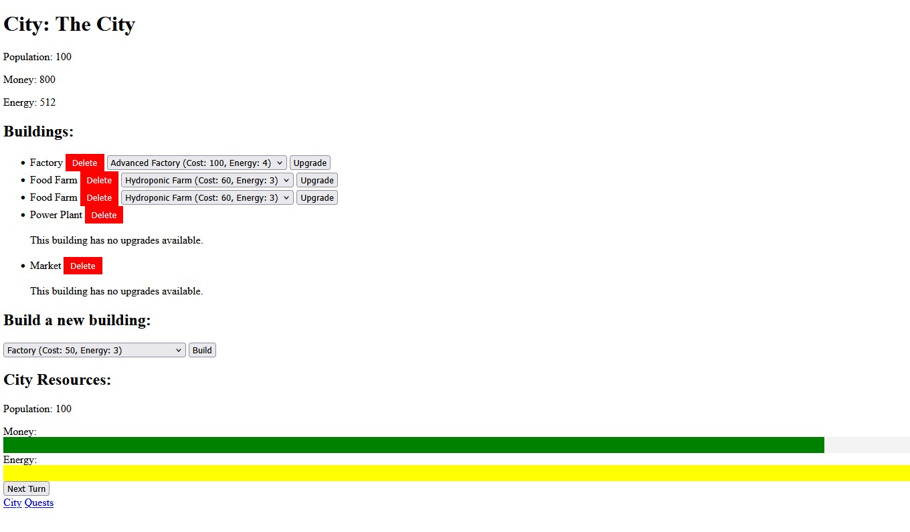

# City Management Simulator

A small turn-based city management simulator built as a practice project.  
Implements a simple server-rendered game loop using Express and EJS.

## Screenshot



## Features

- Create and manage a city
- Build and upgrade structures (e.g. farms, factories)
- Resource tracking (money, population, energy)
- Turn-based progression
- Basic quest/reward mechanics
- Server-rendered UI with EJS templates

## Run locally

```bash
npm install
npm start
```

## Open:
http://localhost:3000

## Structure
views/ — EJS templates (UI rendering)
routes/ / server.js — request handling and game logic
models/ (if present) — data structures for city/state
Limitations
No persistence (state resets on server restart)
No authentication or multi-user support
Game logic is simplified (no balancing or scaling)
No frontend state management (full server render)
Minimal validation and error handling

## Tech
Node.js
Express
EJS
JavaScript

## Notes
Server-driven application (no SPA frontend)
State is managed in memory
Project created as a focused exercise in routing, templating, and basic game logic